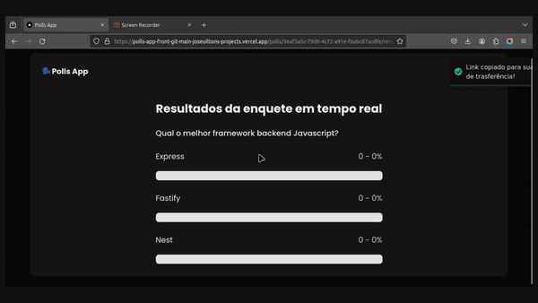

<h1 align="center">
  Polls App
</h1>

<h4 align="center">
  A poll creator with real-time results visualization
</h4>

<p align="center">
  <a href="#about">About</a> •
  <a href="#key-features">Key Features</a> •
  <a href="#languages-and-technologies">Languages and technologies</a> •
  <a href="#prerequisites">Prerequisites</a> •
  <a href="#how-to-use">How To Use</a> •
  <a href="#contact">Contact</a> •
</p>

<div align="center">

[](https://polls-app-front-git-main-joseuiltons-projects.vercel.app/)
</div>


<div align="center">

</div>

## About
This is a simples application inspired by NLW Expert event taught by instructor [Diego Fernandes](https://www.linkedin.com/in/diego-schell-fernandes/), where was developed the backend, the design and frontend was completely planned and developed by me.

## Key Features

- Create an poll
- The owner can share their poll
- The users can vote on the poll
- The owner and users can track the results in real time

## Languages and technologies
Front-end: 


Devops: 

## Prerequisites

To run the project on your machine, you must have <a href="https://nodejs.org/en">Node.js</a> and <a href="https://www.docker.com/">Docker</a> installed, preferably both in their latest stable version.

## How To Use

You must have cloned and configurated the [polls-app-server](https://github.com/joseuilton/polls-app-server) repository to run this app

### Clone this repository
```bash
# Clone this repository
$ git clone git@github.com:joseuilton/polls-app-front.git

# Go into the repository
$ cd polls-app-front
```

### Configure and run App

add a ".env" file api url, follow the structure of ".env.sample"

```bash
# Install all dependencies
$ npm install

# Run App
$ npm run dev
```

## Contact
José Uilton - [@joseuilton](https://www.linkedin.com/in/joseuilton/) - joseuilton.siqueira@gmail.com

---
Made with :purple-heart: by José Uilton
